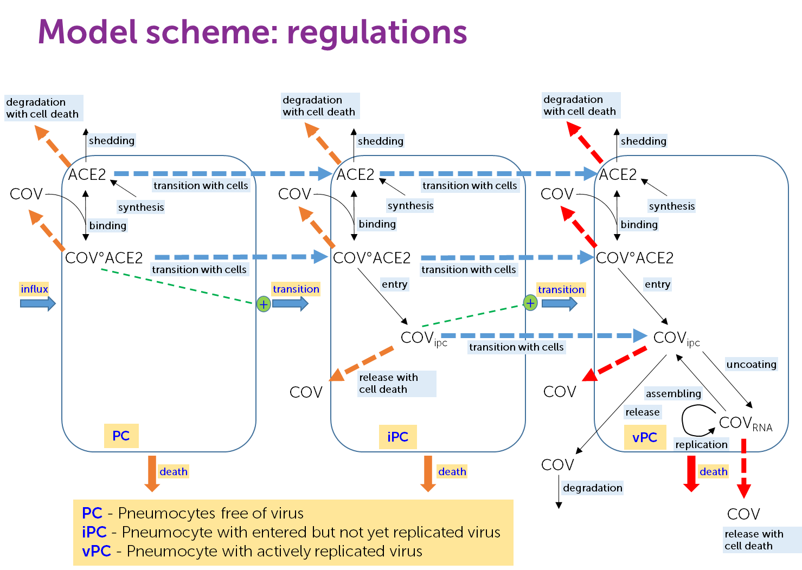

# QSP model of COVID-19

The aim of the project is to develop a Quantitative Systems Pharmacology (QSP) model of COVID-19 describing virus (SARS-CoV-2) and host cell (lung epithelial cells - pneumocytes) life cycles, innate and adoptive immune response and possible therapeutic treatments. 

[](https://hetalang.github.io/)
[](https://github.com/insysbio/covid19-qsp-model/tree/dist)
[](https://GitHub.com/insysbio/covid19-qsp-model/issues/)
[](https://github.com/insysbio/covid19-qsp-model/blob/master/LICENSE)


## Introduction

The ongoing pandemic caused by the novel severe acute respiratory syndrome coronavirus 2 (SARS-CoV-2) has challenged the global public health. Coronavirus disease 2019 (COVID-19) is associated with several respiratory symptoms, including fever and cough that can be progressed to acute respiratory distress syndrome (ARDS) in some patients [???]. There is no cure against COVID-19. More than 500 clinical trials have been conducted or in progress with no definitive confidence in the doses, regimens and outcome tested. QSP modeling approach can possibly contribute to the fight of the global public health system with the COVID-19 via increasing confidence in mechanism based understanding of virus intereaction with host cell leading to immune response and associated inflammation.  

InSysBio has an experience in development of QSP platforms of immune response in different diseases and their applications to address specific questions associated with drug research and development. We have developed  and implemented for internal use QSP software infrastructure including 
1) [Immune Response Template](https://irt.insysbio.com/) (IRT)
2) [Cytocon DB](http://cytocon.insysbio.com/)
3) [Heta language](https://hetalang.github.io/#/) and **Heta compiler**

InSysBio has an experience in modeling of viral dynamics and multiple antiviral drugs and clinically measured outcomes. 

Basing on these considerations we have desided to initiate open sorce project focused on development of template QSP model of COVID-19 and appropriate therapies. The template model will be updated periodically increasing level of its calibration and improving prediction power. 

## Model outline

QSP model of COVID-19 is mathematical model developed on the basis of modular approach. Each module, represents life cycle of a particular cell, is developed independently. Cell lifecycle sub-model is ODE system describing dynamics of states of the cell caused by influx, proliferation, differentiation, activation, death and migration between relevant tissues. Cytokine production/release and regulation of all the processes with cytokines/surface molecules is also included in cell lifecycle sub-model. Cell lifecycle sub-model is partially calibrated against in vitro data. Most of the cell lifecycles will be taken from IRT. These extracted lifecycles will then additionally calibrated against in vivo baseline data describing cell and cytokine concentrations in lung tissue, lymph node and blood extracted from Cytocon DB.



At the initial glance We plan to include in the model following modules:
1) Virus lifecycle including virus binding to pneumocyte, endocytosis, uncoating, replication, assembly and release
2) host cell life cycle including proliferation of type II pneumocytes, their differentiation to type I pneumocytes, death of both cell types, surfactant and cytokine production by type II cells
3) Infected cell responses, including changes in level of secreted molecules, and death
4) Neutrophil and PBM/Mph lifecycles as key element of innate immune response 
5) mDC, NK, CD4+ and CD8+ lifecycles as key elements of adaptive immune response  
6) Clinically measured oucomes charcterizing severety of the disease and treatment results

Source code of the model represents set of heta and excel files which can be compiled to executable version of the model using heta compiler as described in "Usage" section.   

## Usage

### See the project current progress

All results are located in "docs/dist" directory

### Compiled model files

The presented integral model is available in several ready-to-use formats: SBML, mrgsolve, simbio, etc.
All files are recompiled each time when "master" branch updates.
To get them:
- navigate to ["dist" branch](https://github.com/insysbio/covid19-qsp-model/tree/dist).
- or [download distributives](https://github.com/insysbio/covid19-qsp-model/archive/dist.zip) directly.

### Sources for Heta compiler

If you are a [Heta user](https://hetalang.github.io/#/) you can extend the platform by your code or use some of the modules in your model.

**Example**

Creation of qsp platfrom located in "Y:/new-platform" which uses "Cov19_life_cycle" module.

- Get the latest code
    ```sh
    cd Y:/
    git clone https://github.com/insysbio/covid19-qsp-model
    ```
- Create a new platfrom (for example in )
    ```sh
    cd Y:/new-platform
    heta init
    ```
- update an index file "Y:/new-platform/src/index.heta"
    ```heta
    /* my qsp platform */
    include ./qsp-units.heta

    include Y:/covid19-qsp-model/src/Cov19_life_cycle/cov19_life_cycle.heta

    // new initial value
    ACE2_ipc .= 1e-6;

    sbml1 @SBMLExport { filepath: output };
    ```
- run compilation
    ```sh
    heta build
    ```

## Getting help

- Use [Issue Tracker](https://github.com/insysbio/covid19-qsp-model/issues)
- Contact the team: <dev@insysbio.com>

## Contributing

Any contribution is welcomed: bug reports, pull requests (code or documentation), suggestions for improvements.

## License

Licensed under the MIT. See the [LICENSE](./LICENSE) text.

## Contributors

- [Oleg Demin](https://github.com/odemin1965)
- [Evgeny Metelkin](https://github.com/metelkin)
