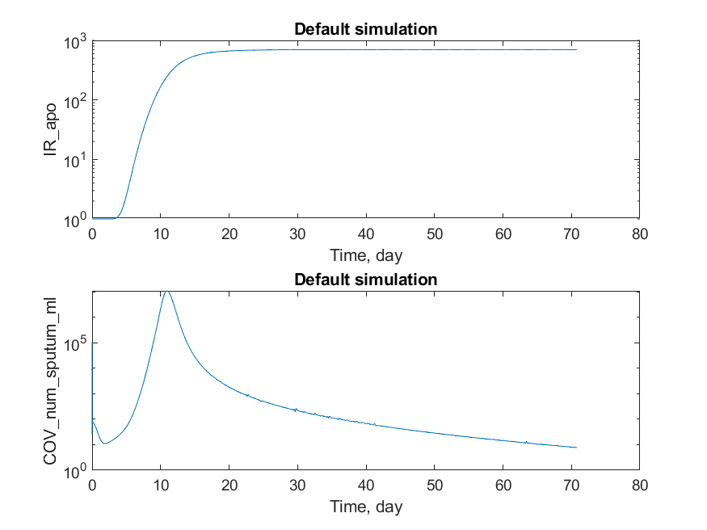

# COVID-19 QSP model / dist branch

[Back to source repository](https://github.com/insysbio/covid19-qsp-model)

*This branch stores auto-generated files using [Heta-compiler](https://hetalang.github.io). They are  generated by GitHub Actions each time when sources are updated in "master" branch.*

## Usage

To download the whole dist branch using [Git](https://git-scm.com/)

```sh
git clone -b dist --single-branch https://github.com/insysbio/covid19-qsp-model.git covid19-qsp-model-dist
```

To refresh "dist" repository

```sh
cd covid19-qsp-model-dist
git fetch
git pull
```

## Diagnostics

### format: SLV


### format: Matlab



### format: Simbio

*Simulations display wrong results in comparison with DBSolve, Matlab and COPASI. 
We are working on Simbio version of the code.*
